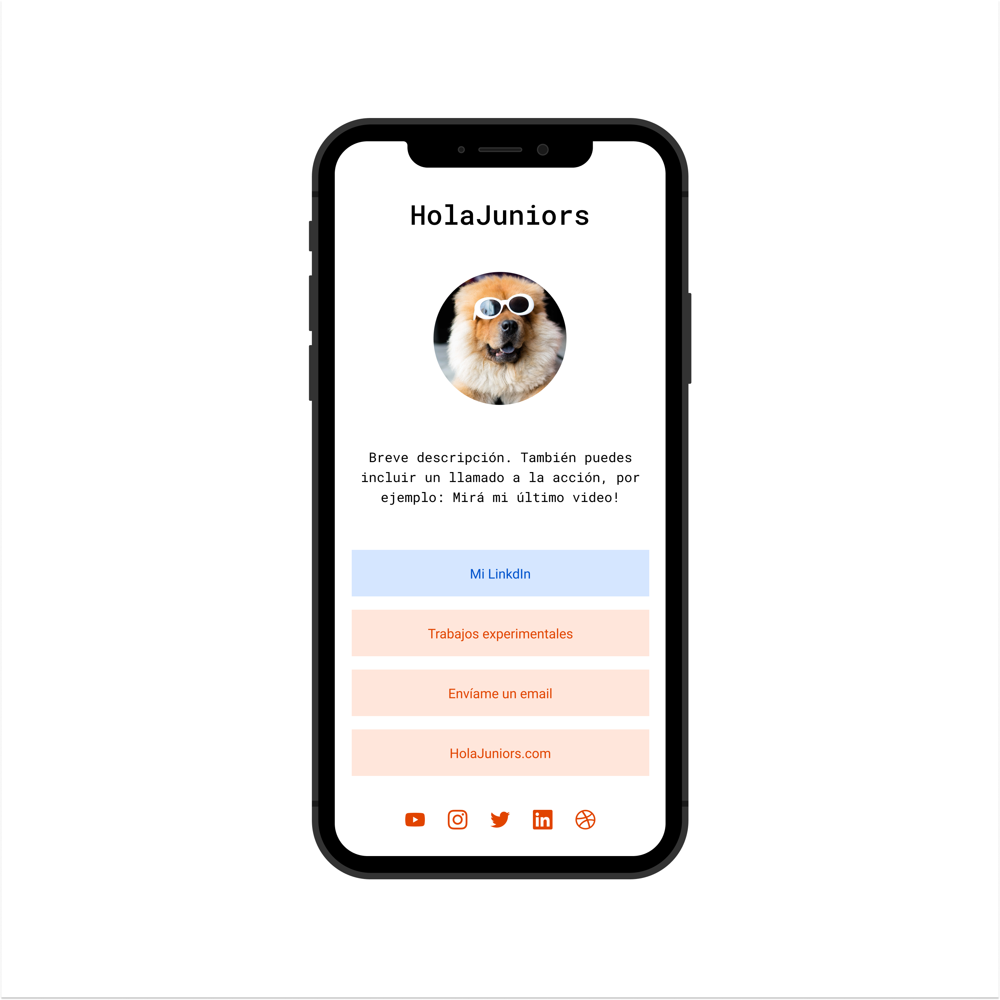

# Instrucciones
En este desafío, te invitamos a mostrar tus habilidades en HTML y CSS para crear una página elegante y funcional que emule el popular estilo de "link in bio". Imagina una página donde puedas presentar una serie de enlaces significativos, similar a la sección de enlaces en biografías de redes sociales.

Tu tarea es replicar el diseño de la imagen de referencia que se encuentra debajo de esta descripción. Puedes personalizar la apariencia de la página utilizando cualquier librería o framework de HTML y CSS que desees.

Este desafío no solo busca evaluar tu habilidad técnica, sino también tu capacidad para replicar y mejorar un diseño existente. ¡Buena suerte!

Imagen de exemplo:

<a href="https://holajuniors.com/challenges/crea-un-listado-de-enlaces-estilo-link-in-bio">Click aquí si quieres ir al sitio web del ejercicio</a>